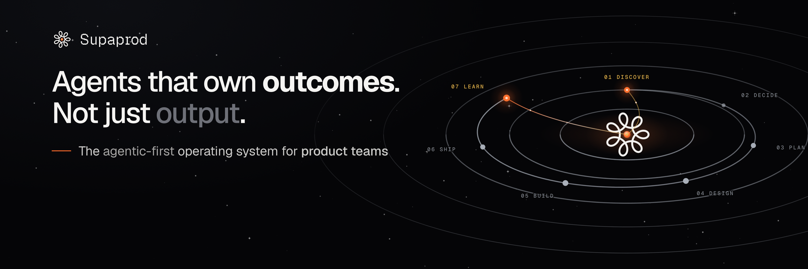

<p align="center">
  
</p>

<h3 align="center">For product managers who ship with agents</h3>

<p align="center">
  <a href="https://supaprod.ai"><b>supaprod.ai</b></a>
  &nbsp;·&nbsp;
  <a href="https://github.com/Supaprod">@Supaprod</a>
  &nbsp;·&nbsp;
  <a href="https://x.com/supaprodhq">@supaprodhq</a>
</p>

> _Last updated: 2026-08-10_

**Market read complete, 2026-08-11.** The full archive was read, all 679 documents and 5,935,025 words, and then tested a second time against funding, hiring, analyst and engineering evidence from entirely outside it. **Three things changed and they are already applied below:** the moat narrowed from *the record compounds* to **the forecast captured at decision time**, because the record turned out to be backfillable and has been backfilled twice on the record; the words changed to the ones practitioners actually use, because *receipts*, *ledger* and *unattended* score at or near zero in this market's own writing; and the front door stayed the **individual PM or founding PM**, which an earlier cycle had briefly widened.

Evidence: [`docs/research/lennys-corpus-sweep-2026-08.md`](./docs/research/lennys-corpus-sweep-2026-08.md) · outside test [`docs/research/market-validation-2026-08.md`](./docs/research/market-validation-2026-08.md) · the pain in customers' own words [`docs/research/customer-voice.md`](./docs/research/customer-voice.md). Canon: [`docs/strategy/positioning-locked-2026-08.md`](./docs/strategy/positioning-locked-2026-08.md). **What is in flight is not here** — status lives in [`docs/planning/SOURCE-OF-TRUTH.md`](./docs/planning/SOURCE-OF-TRUTH.md) and nowhere else.

**Supaprod is where product decisions live when agents do the work. It tells you what to build, builds it, ships it, checks what actually happened, and learns from it, so next time it guides the call instead of waiting to be asked. Wired end to end, from signal to learning and back again.**

> **How to say it to a human (updated 2026-08-11, founder ruling).** The sentence above **used to open "Supaprod is the agentic-first operating system for product teams."** That phrasing is now **retired everywhere, not merely demoted**: April Dunford's work on ~200 B2B positioning engagements finds platform-class words read as meaningless to buyers, and across 5.9M words of this market's own writing **nobody names a lifecycle or an operating system.** The public line for a stranger is now **"For product managers who ship with agents"** — narrow on purpose, because **nobody self-identifies as a team**, and because the land motion is a person who can start without procurement. Lead with the three beats, which are the practitioner's language, not ours:
>
> **1.** The half of the job that was doing the reps is going to agents.
> **2.** What doesn't compress: **deciding what's worth doing, defining what good looks like, and catching when the system is confidently wrong.**
> **3.** Supaprod runs those three — and keeps what you believed *before* you found out.
>
> Beat 2 is verbatim from an operator, and those three jobs are exactly stations **02 Decide, 03 Plan and 07 Learn**. The felt promise in one line, also his: **"Less operator, more director."** Category line under test: *"There is no GitHub for product decisions."*

This file is the front door: what the product is, why it holds, and where every other document lives. It is the only navigation map in the repo. If you are here to **build**, read [`AGENTS.md`](./AGENTS.md) instead.

---

## The three layers. This is the product.

**Everything else in this file is detail under these three.** They are named and ordered, always told **door, then body, then brain**, one headline per surface, brain as the crescendo. Never all three at once.

| | Layer | What it does | The word for it |
| --- | --- | --- | --- |
| **01** | **The director** | Tells you what to build. Reads your signals, your product data, your competitors and your own past calls, and ranks what is worth doing next. | *marigold* `#e8b44c` |
| **02** | **The operating system** | Runs the whole lifecycle. Seven stations that agents walk on their own, inside boundaries a human sets in advance. | *blue* |
| **03** | **The brain** | Learns, and then guides. Not where the record lives: it compounds, tells you what is right next time, and warns before you repeat what was wrong. | *green* |

**Why the order is not arbitrary.** The door is who it is for, so it earns attention. The body is what it does, so it earns belief. The brain is why it wins, so it earns the close. Leading with the brain sounds like a database; leading with the door and never reaching the brain sounds like a workflow tool.

**Why all three have to be one product**, which is the earned insight and the answer to "isn't this three companies": *you cannot be the brain without owning the loop that generates outcomes, and you cannot run the loop without being the operating system.* Each layer is the precondition for the next. Ship any one alone and it is a feature.

This maps onto YC's own three Requests for Startups, which is confirmation rather than strategy: "Cursor for Product Managers" (the door), "The AI Operating System for Companies" (the body), "Company Brain" (the brain). **"Company brain" is YC's phrase, quoted and attributed, never our brand identity.** Our owned words are the forecast captured at decision time, the decision brain, and the evidence behind every call. _(Corrected 2026-08-11: this line previously claimed "the outcome ledger" and "the receipts" as owned words. Both are retired — they score 0.2 and 3.0 per million in this market's own writing, and the ledger claim was falsified separately. The "Company brain" sentence before this one is a deliberate quotation of YC and stays.)_ Canonical memo: [`docs/pitch/repositioning-2026-07-22.md`](./docs/pitch/repositioning-2026-07-22.md).

---

## The claim, and why it compounds

The last verb in that sentence is the whole product, so it is worth being exact about it.

**It learns, and then it guides.** A settled outcome changes what you are shown next. That is the product's job, and it still is.

**But the moat is narrower than that, and it was corrected on 2026-08-10** after a full read of the market — 679 documents, 5,935,025 words ([`docs/research/lennys-corpus-sweep-2026-08.md`](./docs/research/lennys-corpus-sweep-2026-08.md)). The compounding *record* is backfillable, and has been backfilled twice on the record: Vercel's COO ran an agent over *"every Slack interaction, every email, every GONG call"* and reconstructed the true cause of a lost deal — overturning the account executive's own account — with a tool built in two days that runs for about $1,000 a year.

**Causes survive in artifacts. Forecasts do not.**

> **What we lead with is the governed record of agentic product work.** When agents do the work, being able to answer *"why did we decide this, on what evidence, and who signed off"* stops being a nicety and becomes the control that lets you let them run at all. That is a recognised buying requirement with a named market: **AI governance platforms**, which got an inaugural Gartner Magic Quadrant on 2026-06-16 and is forecast at $492M in 2026 growing 45.3% a year.
>
> **What makes that record uniquely ours is the forecast captured at decision time** — what a team believed would happen, recorded *before* the outcome was known. It leaves no trace unless something caught it at the moment of the call. Everything else about a decision can be rebuilt afterwards; that one thing cannot.

**Order changed 2026-08-11, and the reason is not cosmetic.** We used to lead with the forecast. **Corporate prediction markets at Google beat expert forecasts by up to a 25% reduction in mean-squared error and died anyway** (Cowgill & Zitzewitz, *Review of Economic Studies*, 2015; the post-mortem is in *Asterisk*, Nov 2024, where a Waymo VP says the cross-division transparency *"was counter to his division's goal to restrict information like this"*). The mechanism works and gets rejected, because **a pitch that leads with "we record what you predicted so it can be checked later" is selling accountability to the person who would be held accountable.** So the forecast stays, as a byproduct of doing the work whose first consumer is the agent doing the next piece of work, not a scoreboard for a reviewing executive. Full reasoning: [`docs/research/market-validation-2026-08.md`](./docs/research/market-validation-2026-08.md) §8.5.

**The industry has a name for this layer, and it is not ours.** ThoughtWorks put **context graph** at *Assess* on the Technology Radar in April 2026: decisions, policies, exceptions, precedents, evidence and outcomes as first-class connected nodes in a graph structured for AI consumption, where systems of record capture *what* happened and a context graph captures *why*. **Use it with technical buyers and in docs; it is worth more with a CTO than any category we could invent.** Keep it out of the hero, where a term that must be taught before it helps costs more than it earns. And note what its enumeration leaves out: **forecasts.** That omission is the gap we sit in.

**Why storage is not the claim.** Any vendor can store your decisions, and a frontier model release can absorb search over them next quarter. A filing cabinet is not defensible, so describing the brain as one gives away the argument and claims less than the product already delivers.

So lead with the claim everywhere, in this repo and on every surface:

| Say | Rather than |
| --- | --- |
| "it compounds" | "where the record lives" |
| "next time it tells you what is right, and warns before you repeat what was wrong" | "it remembers your decisions" |
| "it guides the next call" | "searchable history" |
| "the brain", which learns and guides | "storage", "archive", "log" (of the brain) |

**That table is phrasing, not a script.** "Remembers", "stores" and "logs" stay banned of the brain on public surfaces, for the reason above and no other — the claim is the company's, not the words. They remain ordinary words elsewhere: a dated shipping log, an app store, a variable named `store`. And no particular sentence is mandated: a hero that says the claim harder in different words ("Agents that own outcomes. Not just output.") is compliant, and rewording one is always free.

**The mechanism, plainly.** A shipped outcome is settled at Learn with a verdict, that verdict is written back against the decision that caused it, and it **re-ranks what Discover and Decide surface next**. The loop does not end in a report; it ends by changing what you are shown. That is why this is an operating system and not a dashboard.

---

## The three things that are true about it

**One loop, not seven tools.** Discover, Decide, Plan, Design, Build, Ship and Learn run as one governed route that agents walk on their own, inside boundaries a human sets in advance. A recorded outcome re-ranks the next bet rather than ending in a report.

**Product judgment compounds, and it is portable across people.** Every decision, the alternatives weighed against it, and what actually happened stay in the workspace record, which is membership scoped. When a product manager leaves, the next person inherits it instead of starting cold. That is the enterprise reason to buy: continuity, audit, onboarding.

> **This limit CLOSED, and the paragraph that used to sit here was understating the product** _(measured against production 2026-08-19; needs the founder's sign-off before it changes any outward-facing answer)_. `agent_memory` is workspace-scoped, not user-scoped. Migration `20260802190000_agent_memory_workspace_visibility.sql` added a `visibility` column defaulting to `workspace`, split the RLS so a member may read a teammate's shared memory, and rewrote both `match_agent_memory` overloads. The live policy is `is_workspace_member(workspace_id) AND (auth.uid() = user_id OR visibility = 'workspace')`.
>
> **All 1,170 rows are `visibility: 'workspace'` and none are user-private**, across 16 workspaces and 12 authors. It is not merely permitted, it is happening: **101 recalls in production had a reader who was not the memory's author.** So the successor inherits the compounded recall, not only the record. _(Query: `agent_memory` grouped by `visibility`, joined to `memory_recall_log` where `r.user_id IS DISTINCT FROM m.user_id`.)_
>
> **So "the record travels, never the memory travels" is retired.** Both travel. One stale assertion remains in code and is worth fixing when someone is next in that file: `src/lib/ai/critic.server.ts:230-234` still comments that recall is writer-scoped.

**Proof, not assertion.** The station-by-station, code-verified account of the loop, carrying a `file:line` for every structural claim and naming the gaps it still has, is [`docs/features/lifecycle-signal-to-learning.md`](./docs/features/lifecycle-signal-to-learning.md). Cite that file. Never claim a step of the loop the repo cannot show in code.

---

## The problem

A product operator owns the whole arc: talk to users, decide what is worth building, write the spec, get it built and shipped, launch it, handle support, and learn from the result. That arc is smeared across fifteen tools with a human manually carrying context across every seam. **The cost of switching, reconciling and re-explaining across those seams now exceeds the cost of the work itself.**

Point AI tools make one seam faster and leave the operator as the glue. To remove the glue, the substrate has to own the whole lifecycle, and agents have to *run* it, not assist it.

The deeper problem: **building is no longer the bottleneck, deciding what to build is.** Code has a fast oracle, it compiles in seconds, so building commoditizes. "What to build, and was it right" has no fast oracle, feedback lands in weeks to quarters, so it does not.

---

## The loop: seven stations, and it is a route, not a conveyor

```
  01 Discover -> 02 Decide -> 03 Plan -> 04 Design -> 05 Build -> 06 Ship -> 07 Learn
       ^                                                                        |
       +------------------------ outcome re-ranks the next bet -----------------+
```

**Work visits the subset of stations it actually needs, and can enter at any of them** (founder ruling 2026-08-01). A copy tweak may go Discover, Build, Ship. A backend change skips Design. An existing product getting one feature enters at Plan or Design, not at Discover, and the loop must never force a real customer through discovery for work whose problem is already settled.

A skipped station is **a decision on the record with a reason**, never a silent omission. The path is policy, not permission: the human sets the routing rule once and the loop routes itself thereafter. That is the line between a workflow tool and an agentic OS.

| Station | What runs there |
| --- | --- |
| **01 Discover** | Signals ingest from every source, cluster into themes, surface what is worth attention. |
| **02 Decide** | A living, re-scored opportunity queue. The Critic red-teams every candidate before a human sees it. |
| **03 Plan** | Cited specs, scope, sequencing, the roadmap. |
| **04 Design** | Scaffolded surfaces checked against the live design system. |
| **05 Build** | Our own engine writes code in the customer's repo, on frontier models via API. |
| **06 Ship** | Release, gates, the deploy path, what customers see. |
| **07 Learn** | The outcome is settled with a verdict, written back against the decision that caused it, and used to re-rank what Discover and Decide surface next. This station is the moat; it is why the loop closes instead of stopping. |

---

## Who it is for

**Front door: the individual PM or founding PM**, drowning in the low-judgment half of the job. Entry is the **Critic teardown**: point Supaprod at a feature you believe in and get an evidence-backed red-team, with the evidence behind every call attached.

**Expansion: the product team.** The decision system of record: governance, audit, shared compounding memory. The conversion happens when a VP wants visibility over what the team decided and whether it paid off.

**Buyer: the VP or Head of Product**, who wants the decision record, the governance layer, and the accountability story.

---

## Why it holds

### The six-month-forward doctrine (founder ruling 2026-08-01)

> We are not building for today's problem. Every solution is designed for where the industry will be **six months from the current date**, and it must also close the pain the user carried from the past.

Five tests, all of which a design passes before it is built:

1. **Assume the model layer commoditizes.** Anything one frontier release could absorb is not a moat. Build the loop, the gates and the record *around* the model, never the thin layer on top of it.
2. **Assume a large vendor ships our vertical next quarter.** Name what we still have that they do not. The answer is the **forecast captured at decision time** — what the team believed would happen, recorded before the outcome was known. Everything else about a decision can be reconstructed afterwards from Slack and call recordings; a forecast leaves no trace unless something wrote it down at the moment of the call. If the answer is "nothing", the design is wrong and gets redone. _(Corrected 2026-08-10: this previously read "the compounding decision-and-outcome record", which the full-corpus sweep falsified — [`docs/research/lennys-corpus-sweep-2026-08.md`](./docs/research/lennys-corpus-sweep-2026-08.md) §2.)_
3. **Agents run it, they do not assist with it.** A surface an autonomous agent cannot run end to end under policy is one we expect to replace, and we design the seam for it now. _(Softened 2026-08-10 from "legacy the day it ships". The bet we are making is on a bottleneck documented in 2021 with no AI present, not on a platform shift. The most credentialed post of its era called web3 "risky and inevitable" and told readers to buy tokens on FTX nine months before it collapsed; inevitability language is how that class of call goes wrong. Note also that "90–95% agentic" is retired — it is contradicted by everyone shipping agents, and graduated autonomy with gates is both what we built and the empirically winning pattern.)_
4. **Solve backwards and forwards.** Close the past pain, serve today's job, leave the seam for the six-month job.
5. **Delight is a requirement, not a finishing pass.**

### Why now

Three things had to be true at once, and they only became true recently.

1. **Agents got good enough to do the work, not just draft it.** Until roughly eighteen months ago the build half of the loop was not possible, so the loop could not close, so nobody could own it.
2. **Code got a fast oracle and judgment did not.** Code compiles in seconds, so an agent can iterate against it, so building commoditizes. "What should we build, and was that right" gets feedback in weeks to quarters. **The expensive half of product work is the half nobody automated, and it is the half that does not commoditize.**
3. **The pieces arrived in the wrong order for an incumbent to notice.** Issue trackers own tickets, doc tools own documents, code tools own repos. None had a reason to own the outcome.

**The window is one to two quarters, and it is closing.** Notion shipped "feedback to a merged PR" copy in July 2026. YC is actively funding this category by name. Whoever holds the outcome-verification loop first accumulates a record nobody can backfill.

### The moat, and where it actually sits

The moat is not one thing, it is **the third layer resting on the first two**. Each layer alone is copyable; the stack is not.

| Layer | Defensible alone? | Why, in detail |
| --- | --- | --- |
| **01 The director** | **No, and we should say so.** | Ranking what to build is a *capability*, not an asset. A frontier model plus a well-written prompt plus access to the same signals gets most of the way there, and gets closer with every model release. **Anyone can rank; the question is whether the ranking is any good, and that is answered by outcomes rather than by the ranker.** Which is why 01 is a door, not a moat: it is what earns the first ten minutes, and it is the layer we would lose first if we tried to defend it. |
| **02 The operating system** | **Partly, and only for a while.** | The loop, the gates, the tenancy model and the tamper-evident record are genuine engineering: months of it, and the reason autonomy is safe enough to sell. But it is *buildable*. A well-funded incumbent with distribution can construct the same route, and Notion has already shipped copy describing part of it. So the honest read is that 02 buys a lead measured in quarters, not a permanent position. **Its real job is to be the precondition for 03.** |
| **03 The brain** | **Yes, and it is the only one.** | It requires **your** decisions, joined to **your** outcomes, labelled over time. That data does not exist anywhere to be bought, cannot be scraped, and cannot be synthesised, because it is *produced as a byproduct of running the loop*. A competitor cannot acquire it, a model release cannot absorb it, and a customer who has run six months of decisions through it holds something their competitor does not. It also gets **more** valuable as the model layer commoditizes, because when everyone has the same reasoning, the differentiator is whose context is better. |

**Read the table as one sentence:** we are honest that two of our three layers are copyable, because that is what makes the claim about the third one credible.

**So the defence is the ordering, not any single layer.** A competitor must own the loop before they can accumulate the record, and by the time they own the loop the record already favours whoever ran it longer.

### The landscape, and the one thing we compete on

**Read the framing before the table, because the framing is the strategy.**

Supaprod *touches* eight surfaces, because a closed loop necessarily passes through all of them. **We compete on exactly one:** whether the outcome of a shipped bet is verified and fed back into the next decision. Everywhere else we integrate, absorb, or deliberately ignore.

That distinction matters commercially and it matters in a pitch. **A company claiming to beat eight categories at once is not focused, it is unfocused with a long list**, and an investor reads it that way. So the table below exists to prove we know the terrain, not to declare eight wars.

| # | Surface we touch | Who owns it today | Our posture | Why |
| --- | --- | --- | --- | --- |
| 1 | **Outcome verification and decision memory** | **Nobody, and this is the whole company** | **COMPETE** | The bet is recorded, the result is settled against it, and that re-ranks what comes next. Measured empty in a fresh sweep: the drafting tools do not check, the workspaces do not close, the labs have no customer outcomes. **This is the only row where we intend to win.** |
| 2 | Issue tracking and the workspace | **Linear, Notion**, Jira, Monday, Asana, Height, Shortcut | **RACE, carefully** | **The genuine threat.** They have distribution we do not, and Notion shipped feedback-to-merged-PR copy in July 2026. They dispatch work; they do not verify outcomes. We do not try to be a better tracker. |
| 3 | Product management suites | Productboard, Aha!, Airtable, Coda, Fibery | ABSORB | Roadmap and prioritisation surfaces built for a human to fill in. Their information model assumes a person does the judgment. Ours assumes an agent does the work under policy. |
| 4 | Code generation | Cursor, Claude Code, Lovable, Devin, Replit, Bolt, v0, Factory, Cognition | **IGNORE as competitors** | Racing to zero on a fast oracle. They are this era's proof that agents can do real work. **Not our subcontractors either:** our build engine is our own, running frontier models by API in the customer's repo. |
| 5 | PRD and spec drafting | ChatPRD, Spark, plus every chat tab | ABSORB | Drafting is the cheap half and it commoditized first. One station of ours. |
| 6 | Customer feedback and signal | Dovetail, Enterpret, Cycle, Kraftful, Viable, Unwrap, Gong, Intercom | **INTEGRATE** | They are inputs, not rivals. Layer 01 reads them through one Connect button. Competing here would be replacing a source we want to consume. |
| 7 | Experimentation and analytics | Amplitude, Mixpanel, PostHog, Statsig, LaunchDarkly, Pendo | **INTEGRATE** | **Where the outcome actually lands, and the reason row 1 is possible at all.** They hold the number and never the decision that caused it, so nobody joins a result back to the call that produced it. We read the result rather than own the measurement. |
| 8 | The model layer | Anthropic, OpenAI, Google | INTEGRATE | An input we orchestrate. A better model makes layers 01 and 02 better for free. |

**The investor-facing version of this table is the deck appendix**, slide A1 at [supaprod.ai/brief](https://supaprod.ai/brief), which frames the same landscape as six *relations* (race, absorb, engines, sense silos, rails, measure) with a **"what they do not keep"** column. That column is the sharper form of the argument, so keep the two in sync: source is `public/brief.html`, mirrored in [`docs/pitch/investor-deck/`](./docs/pitch/investor-deck/README.md).

**Say it in one line when asked "who are your competitors":** *"On the loop closing, nobody, and that is the bet. On the workspace, Linear and Notion, who have distribution we do not and no outcome verification. Everyone else in this space is either an input we read or a category we absorb."*

**The frontier test, applied.** When a lab ships a better model, layers 01 and 02 improve and layer 03 is untouched, because no model has your outcomes. That is why the six-month-forward doctrine above is a gate and not a slogan.

Full canon, the integrate/absorb/race/ignore reasoning per competitor, and the objection Q&A with answers: [`docs/strategy/moat.md`](./docs/strategy/moat.md). For a live conversation: [`docs/pitch/founder-answer-playbook.md`](./docs/pitch/founder-answer-playbook.md).

### How it makes money

**A tier sells seats and capability. Credits sell capacity.** Keeping those two axes separate is the whole model, and conflating them is the mistake it was built out of (founder ruling 2026-08-03, and the reasoning is in `src/lib/billing-tier.ts` if you want the autopsy).

| | Free | Pro | Business | Enterprise |
| --- | --- | --- | --- | --- |
| **Price** | $0 | **$20**/mo | **$50 per seat**/mo | committed contract |
| **Credits / month** | **750** | **3,750** | **15,000 pooled** | committed pool |
| **Seats** | 1 | 1 | **minimum 2** | **unlimited** |
| **Memory** | decays | persistent | shared across the team | plus governance and audit |
| **Your tools** | **up to 3 connectors, read-only** | **unlimited connectors, read-only** | **unlimited, and writes back** | that, plus **custom connectors built for you** |

**What "your tools" means, concretely.** Supaprod is only useful if it reads what you already have, so connecting a source is one OAuth click and never a key you paste into a config file. **Ten providers have a working adapter today:** GitHub, GitLab, Slack, Intercom, Zendesk, Canny, Productboard, Salesforce, HubSpot and Stripe. **Eleven more are registered but stubbed**, including Linear, Notion, Jira, Figma and Gmail (`src/lib/connectors/providers/index.server.ts`), so do not imply they work. Across the four things layer 01 needs:

| What it needs | Connects to |
| --- | --- |
| **What customers say** | Intercom, Zendesk, Slack |
| **What the team is doing** | Linear, Jira, GitHub, Notion |
| **What the product data says** | PostHog, and the analytics surface where an outcome actually lands |
| **Who the customer is** | Salesforce, HubSpot |
| **The daily substrate** | Google Suite (Docs, Calendar, Gmail, Tasks), Microsoft Outlook and Mail, Figma |

**Read-only versus write-back is a permission boundary, not a paywall trick.** Every paid tier can connect **every** connector. What changes is what Supaprod is allowed to *do* there:

- **Free: three connectors, read-only.** Enough to point Supaprod at your own data on day one, because the loop cannot be judged on somebody else's. Three is a deliberate number: it covers a signal source, a tracker and a doc store, which is the minimum for the loop to visibly close.
- **Pro: unlimited connectors, still read-only.** Connect everything you have. It ingests and reasons across all of it, and it never posts, never comments, never moves a ticket. Everything it produces stays inside Supaprod for you to act on.
- **Business: data flows both ways.** An agent may act in the tool: open the Linear issue, push the branch, reply on the Intercom thread, write the Notion page. That is a genuinely different risk posture from reading, which is why it sits with the tier that also has RBAC, approval lanes and an audit trail.
- **Enterprise.** Everything Business has, plus **connectors built for the systems you run that nobody publishes an API story for**, and admin control over which are permitted at all.

**So the axis is direction, then breadth.** Free and Pro are **in only**; Business is **in and out**. Free caps how many sources, Pro removes the cap, Business changes what Supaprod is permitted to do with them.

**This is enforced in code, not just priced.** `connectorTier` is a real entitlement (`"none" | "read" | "read_write" | "custom"` in `src/lib/entitlements.ts`) and the guard **throws** when a plan attempts an operation it does not permit. An agent on a read-only plan cannot write to a board it is only allowed to read.

> **Both deltas are now closed, and a third one was found while checking** (2026-08-07). Free is `connectorTier: "read"` and `connectorLimit: 3` in `src/lib/entitlements.ts`, so the 2026-08-04 ruling is implemented rather than pending. This paragraph described the pre-ruling state for three days after it stopped being true.
>
> **The third delta was the one that mattered.** `src/lib/connectors/catalog.ts` derived `minTier` as `"pro"` for every read-only connector, so a Free workspace was entitled to three sources and was never offered one. An entitlement that exists and cannot be reached is worse than no entitlement, because the cap is enforced while the motion it was meant to enable cannot start. Corrected to `"free"`; outflow-capable connectors still require Business.

Live status per provider is [`docs/operations/connectors/README.md`](./docs/operations/connectors/README.md). **Nine adapters are real** (GitHub, Intercom, Stripe, Slack, Zendesk, HubSpot, Salesforce, Canny, Productboard) and **eleven are `stubAdapter`** (Linear, Notion, Google Docs, Google Calendar, Google Tasks, Microsoft Outlook, Gmail, Microsoft Mail, Figma, Jira, Firecrawl), verified against `src/lib/connectors/providers/index.server.ts` on 2026-08-07. Do not name a stub as available in any outward-facing copy.

Live status per provider, including the two registered but not yet confirmed against real data, is [`docs/operations/connectors/README.md`](./docs/operations/connectors/README.md).

Annual billing is roughly **17% off** (monthly x 10/12). Numbers above are the shipped reference values; the founder sets the final Stripe catalog.

**Every action spends credits.** Not only deliverables, not only "decision work": running an agent, generating a spec, a build run, a research brief. That is the honest description, and it is why the allowance per tier is generous rather than tight. What stays free is the **trust layer**, so traces, evals and verification never cost you, and a run you **stop early** does not complete a charge.

**Top-ups, because a credit model is only as good as its refill.** Add credits any time, **up to twice your monthly allowance**, with **no plan change** (`topUpCycleCap = grant x 2`). A Pro user can therefore reach **three times** their allowance without being pushed onto a team plan. Default is **stop-at-allowance**: you run out rather than get billed, with a quiet nudge near the limit.

> **Why Business is per seat while Free and Pro are not.** Free and Pro are single-seat, and more power for one person is more credits rather than a different plan. Business starts at two seats because **two people is where a team starts**, and what the higher price buys is the collaboration and governance layer, not capacity. Pushing a solo user onto a team plan to get volume would charge them for collaboration they did not ask for.

**What this replaced, and why it is worth knowing.** Until 2026-08-03 the price scaled linearly off a 100-to-10,000 credit band picker. That produced two defects visible on the live public page: **Pro's default was 100 credits for $20 against a Free tier granting 750**, so the entry paid plan was 7.5x worse than free and matching the free grant cost $160 a month; and the top band rendered **"$2000/mo"** for volume whose underlying cost is about $2. The band is retired, price is flat per tier, and capacity moved to top-ups where it belongs.

Full model, unit economics, and the BYOK stance (an advanced option from Business up, metered and governed with a thin platform fee): [`docs/strategy/pricing/pricing-architecture.md`](./docs/strategy/pricing/pricing-architecture.md). The live page is `src/routes/pricing.tsx`, which is the authority when a document disagrees with it.

> **Four tiers, and only four** (founder ruling, restated 2026-08-04). The public grid already agrees: `PUBLIC_PLAN_TIERS` is `["free", "pro", "team", "enterprise"]`. A fifth slug, `max`, lingers in the internal `PLAN_TIERS` list and in one leftover icon mapping, but **it is not offered and must not appear on any surface or in any document.** Note also that **Business is the `team` slug** in code, because the locked display name landed before the rename. Reconciling the slugs is open work, tracked in [`docs/planning/SOURCE-OF-TRUTH.md`](./docs/planning/SOURCE-OF-TRUTH.md).

**And your data is yours.** Full export in open formats, any time. A record that compounds is only a retention argument if leaving is genuinely possible; otherwise it is a trap, and buyers can tell the difference.

---

## Positioning canon

**These are founder-ratified and supersede conflicting copy anywhere in this repo.** Outward-facing work starts here, then goes to [`docs/pitch/`](./docs/pitch/README.md).

- **Tagline, ratified 2026-07-22:** "Agents that know what to build, ship it, and remember."
  Support line: "One agentic operating system, every call on the record."
  Journey kicker: `signal -> shipped -> remembered`.
  > **This string predates the learns-and-guides ruling above and loses to it on any public surface.** The live product already moved: the landing hero reads "Agents that own outcomes. Not just output." and `src/routes/index.tsx` carries "…ship it, and guide the next call." Restating the ratified wording across [`docs/pitch/`](./docs/pitch/README.md) is open work and needs the founder, so it is flagged here rather than silently rewritten. Until it lands, ship the guiding form.
- **The three layers, always named and colored:** 01 the director (tells you what to build, marigold `#e8b44c`) · 02 the operating system (runs the whole lifecycle, blue) · 03 the brain (learns, then guides, green).
- **The brain compounds.** Next time it tells you what is right, and warns before you repeat what was wrong. Never say "where the record lives": that framing hands away the one part of this that is defensible.
- **Public launch date on every external surface: 30 September 2026.**
- **Market sizing ladder:** TAM $300B+/yr (2.6M PMs x ~$115K loaded). SAM $2B to $12B/yr. SOM ~$47M ARR. Arithmetic in the deck appendix B.
- **Never list, investor material:** no commit counts or feature-register numbers, no YC mentions in generic materials, self-build story implicit only, no "Cursor for PMs" phrasing on surfaces, employer is "Intellect, a leading BFSI technology OEM", education shows TUM only.
- **Contact:** founder@supaprod.ai · investors@supaprod.ai · linkedin.com/in/rohit-gajaraj.

**The triple-RFS telling** (2026-07-22): Supaprod sits at the intersection of YC's own three requests, one product at three altitudes. **The door** (who it is for) then **the body** (the closed loop) then **the brain** (the compounding memory, always the crescendo). One headline per surface, never all three at once. "Company brain" is YC's phrase, quoted and attributed, never our brand identity. Canonical memo: [`docs/pitch/repositioning-2026-07-22.md`](./docs/pitch/repositioning-2026-07-22.md).

---

## Where this actually is, stated plainly

**Read this before believing anything else in the file.** The engine is deep; market contact is near zero. Both halves are true and the second one is a decision, not an accident.

| | |
| --- | --- |
| **Users** | 8, all founder or internal. **Zero organic external users.** |
| **Revenue** | None. Billing is built, tested, and deliberately switched off. |
| **Public launch** | **30 September 2026** |
| **Built** | 1,440 source files · 79 authenticated routes · 151 server-function modules · 462 migrations · 402 test files, 7,159 passing |
| **Open work** | 31 register rows. 371 shipped. |
| **Production data** | **6 workspaces, all founder or test accounts. No customer data at all.** 18 missions · 5 decisions · **0 learnings.** The loop is wired and proven; it begins accruing on first real use. Query: `production_workspace_ids()`. |
| **Team** | Solo founder. No entity incorporated yet. US-primary. |

**Why no users yet, said as the decision it was.** A half-built loop teaches you the wrong thing. The whole claim is that the loop *closes*, that a shipped outcome changes what you are shown next, and you cannot validate that with a partial loop; you get feedback on a demo instead of on the thesis. The loop closes now.

**What is honestly not finished:**

- ~~`agent_memory` is scoped to the user who wrote it~~ **Closed, and it was understating us.** Memory is workspace-scoped: all 1,170 rows are `visibility: 'workspace'`, and 101 production recalls already had a reader who was not the author. Both the record and the compounded recall travel. Full evidence in the callout above; **founder sign-off needed before this changes an outward-facing answer.**
- Enterprise governance (SSO, full audit, roles) is architected, not built.
- `fanout.server.ts` still passes an explicit `null` spend cap, which reads as a deliberate no-ceiling on that one path while every other writer resolves through `resolveMissionSpendCap`.
- Nothing tests `discover/ranking` and `discover/format` together, so a format-helper change can reorder the Discover queue with all 212 unit cases green.

**And the finding that shapes how we verify anything.** On 2026-08-02, nine separately shipped features were found doing nothing in production. All nine passed typecheck and the full suite; two had unit tests asserting the defect as the contract. **None was found by reading code.** They were found by querying the live database, and a detector now exists so the tenth is caught automatically. Treat a green test as evidence the code does what the test says, and nothing more.

Live status: [`docs/planning/SOURCE-OF-TRUTH.md`](./docs/planning/SOURCE-OF-TRUTH.md) §0.

---

## Architecture

Two views, because "how is it built" and "how does a person move through it" are different questions and the second one is the product.

### 1. What a user actually does

```
        ┌──────────────────────────── Ask (top right, any surface) ────────────────────────────┐
        │            one composer, opens a pane, can start work at any station                 │
        └──────────────────────────────────────────────────────────────────────────────────────┘

  /today ──► the daily ritual: what changed, what needs you, what agents did overnight
     │
     ├──► 01 /discover   signals land from every source ──► cluster into themes ──► what deserves attention
     │         │                                                    ▲
     │         ▼                                                    │
     ├──► 02 /decide     the ranked bet queue · the Critic red-teams it BEFORE you see it
     │         │                                                    │
     │         ▼                                                    │  the outcome
     ├──► 03 /plan       the cited spec, scope, sequencing          │  re-ranks
     │         ▼                                                    │  what appears
     ├──► 04 /design      surfaces scaffolded against the live system   here
     │         ▼                                                    │
     ├──► 05 /build       our engine writes code in your repo · diffs · the merge gate
     │         ▼                                                    │
     ├──► 06 /ship        release, gates, what customers see        │
     │         ▼                                                    │
     └──► 07 /learn       the verdict is settled ────────────────────┘
               │
               ▼
          /brain          the compounding record: decisions, evidence, outcomes, and what it now advises
                          (/knowledge for the graph view)

  /engine-room            one recessed door: traces, evals, prompts, budgets, guardrails, incidents
                          the machinery is reachable on demand and never in the way
```

**Three things this view is meant to make obvious.** Work **enters at any station**, so an existing product getting one feature starts at `/plan` and never sees discovery. The line back from Learn to Discover **is the product**; without it this is a workflow tool. And every piece of machinery lives behind **one door**, because the user should meet the output of the machine, never the machine.

### 2. How a request is served

```
  CLIENT            TanStack Start (React 19 + Vite 7) · Tailwind v4 · shadcn/ui
                    deployed as a single Cloudflare Worker
                      │ typed server functions              │ /api/public/hooks/*
                      │ (one module per domain)             │ (cron, ingest, webhooks)
                      ▼                                     ▼
  TENANCY GATE      account ─► workspace ─► product
                    Supabase Auth, then RLS keyed on MEMBERSHIP in the database
                    ── not in application code, which is why autonomy is safe here
                      │
                      ▼
  ORCHESTRATION     the seven-station route · the agent loop · the Critic
                    policy resolution (trust arc, tool risk floors, spend ceilings)
                    a skipped station is recorded WITH ITS REASON, never silently
                      │
                      ▼
  AI CHOKEPOINT     src/lib/ai/runtime.server.ts ── EVERY model call, no second path
                    budget ─► credits ─► cache ─► pre-guard ─► RAG ─► PROVIDER
                                                    ─► post-guard ─► humanize ─► log
                      │                                     │
                      ▼                                     ▼
  MODELS            model-agnostic, selected per job     DATA   Supabase Postgres
                    our keys, credits-metered                    RLS · pgvector · pg_cron
                    BYOK from Business up, thin platform fee   embeddings via Cohere embed-v4
```

**The chokepoint is the design decision that matters most.** One function sees every model call, so budgets, guardrails, cost tracking, caching, provider routing and output sanitising are each implemented once and cannot be bypassed. A new AI surface needs a valid `CallSurface` literal, which means an unbudgeted or unguarded call is a type error rather than an incident.

Hosting, the database, auth and deploys are provisioned and managed by **Lovable**, which is the live system of record. **Pushing does not deploy**; the founder clicks publish. Contracts per layer: [`architecture/`](./architecture/README.md).

---

## Run it

Bun is the package manager and runner.

```bash
bun install        # deps (bunfig.toml enforces a 24h supply-chain guard)
bun run dev        # Vite dev server, verify UI changes here
bunx tsc --noEmit  # typecheck
bun test           # unit + integration
bun run build      # production build (Vite -> Cloudflare Worker)
bun run lint       # ESLint
```

Database changes are timestamped, RLS-aware SQL in `supabase/migrations/`. Applying them is done through Lovable, not a local Supabase CLI.

**Logins for demos and testing:** [`docs/operations/demo-credentials.md`](./docs/operations/demo-credentials.md). Do not paste credentials into other docs; that file is the only copy, and it carries a warning about which rows have been verified. Rehearse on the `harbor@` account, never on one you plan to send out.

---

## Where everything lives

**Root holds four files, and nothing else.** Each answers one question.

| File | Answers | Read it when |
| --- | --- | --- |
| **`README.md`** (here) | What is Supaprod, and where is everything? | Evaluating it, or looking for another doc. |
| [**`AGENTS.md`**](./AGENTS.md) | How do I build it? | Writing any code, human or agent. The rules, gates and invariants. |
| [**`CLAUDE.md`**](./CLAUDE.md) | Claude Code specifics | Auto-loaded by Claude Code. Thin by design. |
| [**`GEMINI.md`**](./GEMINI.md) | Gemini / Antigravity specifics | Auto-loaded by those tools. Thin by design. |

### By what you are doing

| If you want... | Go to |
| --- | --- |
| **Where we are, what is next, what needs the founder** | [`docs/planning/SOURCE-OF-TRUTH.md`](./docs/planning/SOURCE-OF-TRUTH.md) §0. The only status file. |
| **Per-feature status and claims** | [`docs/planning/SOURCE-OF-TRUTH.md`](./docs/planning/SOURCE-OF-TRUTH.md) |
| **What the last session did and left open** | [`docs/operations/session-handoff.md`](./docs/operations/session-handoff.md) |
| **Which strategy doc is current** | [`docs/strategy/README.md`](./docs/strategy/README.md), the arbiter. Direction: [`docs/strategy/v11-guiding-star.md`](./docs/strategy/v11-guiding-star.md). Moat: [`docs/strategy/moat.md`](./docs/strategy/moat.md). |
| **The product film (2:22, shipped 2026-08-12)** | [`videos/supaprod-film/README.md`](./videos/supaprod-film/README.md) — the film submitted with accelerator applications: its masters, every source layer (script, frames, mix, voice, music), and the two pipelines for changing it. |
| **⭐ Writing an application, pitch, or demo** | [`docs/pitch/`](./docs/pitch/README.md), **the Pitch Room.** Its README carries the seven-step procedure for a new accelerator or investor application: which programs are worth applying to, the two blockers that kill most of them, where to pull answers rather than compose them, the facts that get fumbled, and the never-list. Start there, never from scratch. For a live investor or interview conversation, [`docs/pitch/founder-answer-playbook.md`](./docs/pitch/founder-answer-playbook.md) is the trainer, and it is updated after every one. |
| **Design: the live system** | [`docs/design/DESIGN-SYSTEM.md`](./docs/design/DESIGN-SYSTEM.md). The shipped `--sp-*` shell is the baseline; every earlier design contract is retired history. |
| **How a feature works, end to end** | [`docs/features/`](./docs/features/README.md). The loop's proof file: [`docs/features/lifecycle-signal-to-learning.md`](./docs/features/lifecycle-signal-to-learning.md). |
| **Architecture contracts** | [`architecture/`](./architecture/): runtime · orchestration · security · data · frontend · integrations. |
| **Durable conventions** (voice, chrome, destructive actions, engine room) | [`docs/conventions/`](./docs/conventions/README.md) |
| **Ops: commits, hooks, skills, memory, demo logins** | [`docs/operations/`](./docs/operations/) |
| **Pricing and billing** | [`docs/strategy/pricing/`](./docs/strategy/pricing/README.md), start at `pricing-architecture.md`. |
| **Market and competitor evidence** | [`docs/research/`](./docs/research/) |
| **GTM execution, brand ops** | [`docs/growth/`](./docs/growth/README.md) · [`docs/growth/brand-ops/`](./docs/growth/brand-ops/README.md) |
| **The founding constitution** | [`docs/strategy/founding-constitution.md`](./docs/strategy/founding-constitution.md) |
| **What shipped, historically** | [`docs/planning/archive/build-log.md`](./docs/planning/archive/build-log.md) |

**Before creating any file**, read the placement policy in [`docs/README.md`](./docs/README.md). One purpose per doc, extend before you create, archive before you orphan, and link it from its folder index in the same commit.

---

## Naming

The product is **Supaprod**: lowercase `supaprod` for domains, handles and slugs, `Supaprod` in prose, `SUPAPROD` only in legal contexts, and never camel-case "SupaProd". It shipped as *Cadence* until the rename executed on 2026-07-17. That name is retired, with three narrow exceptions: the generic English word ("release cadence", the DB `cadence` column), dated historical narrative, and a short list of internal identifiers left unmigrated on purpose. The ledger of those: [`docs/operations/rename-cadence-to-supaprod.md`](./docs/operations/rename-cadence-to-supaprod.md).

## License

Permissive intent. Until chosen: all rights reserved, © Supaprod contributors.
